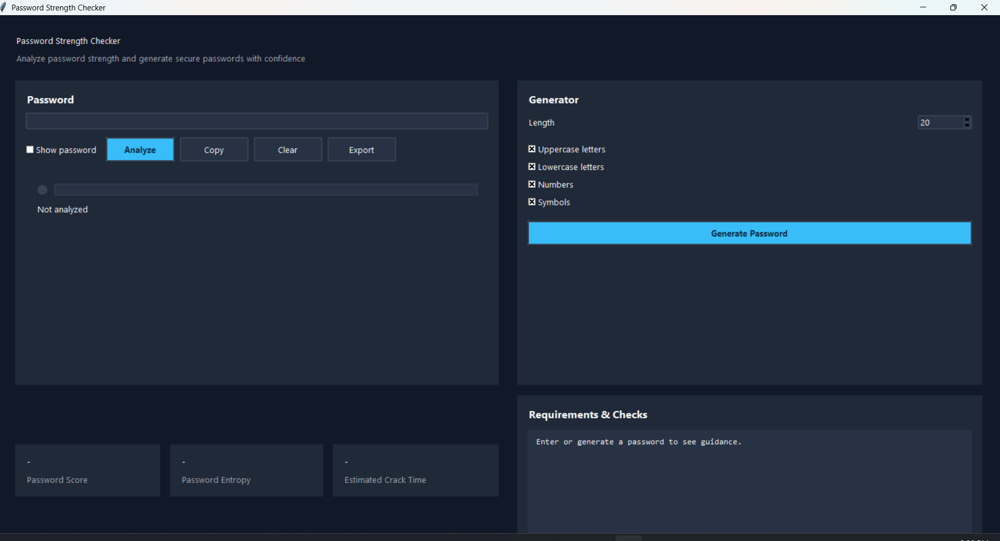
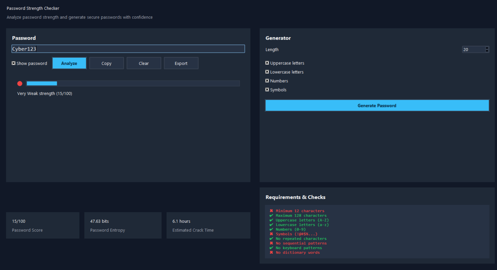
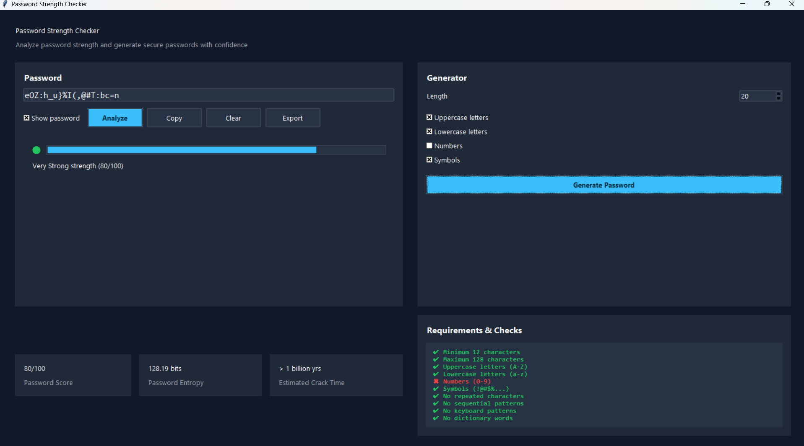

# Password Strength Checker

A Python desktop application for password strength analysis and secure password generation built with **Python** and **Tkinter**.

## Overview

Password Strength Checker is an offline cybersecurity tool that evaluates password strength using multiple security checks, including entropy estimation, pattern detection, and common password analysis. It also generates strong passwords using Python's `secrets` module.

## Purpose

This project was developed as part of my cybersecurity learning journey to explore password security, entropy estimation, secure password generation, and secure software development practices using Python.

## Features

### Password Analysis
- Password strength score (0–100)
- Entropy calculation
- Estimated password crack time
- Common password detection
- Dictionary word detection
- Sequential and keyboard pattern detection
- Rule-by-rule validation
- Security recommendations

### Password Generator
- Configurable password length (12–128)
- Uppercase, lowercase, numbers, and symbols
- Cryptographically secure generation using `secrets`
- Automatic analysis of generated passwords

### Export
- TXT
- JSON
- CSV

### User Interface
- Tkinter desktop GUI
- Strength meter
- Password entropy display
- Estimated crack time
- Copy to clipboard
- Keyboard shortcuts

---

## Screenshots

### Main Window



### Password Analysis



### Password Generator



## Project Structure

```text
password-strength-checker/
├── docs/
├── resources/
├── src/
├── tests/
├── README.md
├── CHANGELOG.md
├── LICENSE
├── pyproject.toml
├── requirements.txt
├── requirements-dev.txt
```

---

## Installation

### Clone Repository

```bash
git clone https://github.com/Sithiraharithajeewa/password-strength-checker.git
cd password-strength-checker
```

1. Clone the repository

```bash
git clone https://github.com/Sithiraharithajeewa/password-strength-checker.git
cd password-strength-checker
```

### Create Virtual Environment

```bash
python -m venv venv
```

Windows

```bash
venv\Scripts\activate
```

Linux / macOS

```bash
source venv/bin/activate
```

### Install

```bash
pip install -e .
```

Optional

```bash
pip install -r requirements-dev.txt
```

---

## Usage

Run the application

```bash
python -m password_strength_checker.main
```

---

## Keyboard Shortcuts

| Shortcut | Action |
|-----------|--------|
| Enter | Analyze Password |
| Ctrl+C | Copy Password |
| Ctrl+G | Generate Password |
| Tab | Navigate Controls |

---

## Technologies

- Python 3.13+
- Tkinter
- pytest
- mypy
- Tkinter
- pytest
- mypy
- ruff

---

- Key Python libraries:
  - pathlib
  - dataclasses
  - typing
  - logging
  - csv
  - json
  - secrets

## Testing

Run the test suite:

```bash
python -m pytest
```

Run linting:

```bash
python -m ruff check .
```

Run type checking:

```bash
python -m mypy src
```

## Future Improvements

- Multi-language support
- Theme customization
- Password policy profiles
- Additional password analysis rules

---

## License

MIT License
